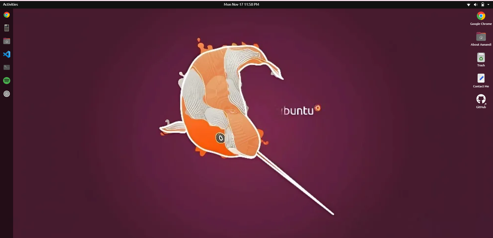

# 🐧 UbuntuOS Portfolio

A fully interactive **Ubuntu-themed developer portfolio** built using **Next.js**, **React**, and **TailwindCSS**.  
It simulates a real operating system with draggable windows, terminal, context menus, apps, and a window manager — all designed to showcase your skills in the most creative way possible.

---

## 📸 Demo
 > 

---

## 🚀 Features

- 🪟 **Custom Window Manager** — draggable, resizable, and focus-aware windows
- 💻 **Terminal Emulator** — includes custom commands like `cd`, `ls`, `about-aanandi`, `clear`, etc.
- 🌐 **Chrome App** — mock browser with working bookmarks
- ⚙️ **Settings App** — change wallpapers dynamically
- 📝 **Gedit App** — contact form or message box
- 🎵 **Spotify App** — themed media window
- 🧮 **Calculator App**, VSCode Clone, Trash Bin, GitHub shortcut, and more
- 🖼️ **Lock & Boot Screens** — immersive Ubuntu-like experience
- ✨ Fully responsive, smooth animations, keyboard navigation

---

## 🛠 Tech Stack

| Category           | Tools                                  |
|-------------------|----------------------------------------|
| Frontend          | React, Next.js, TailwindCSS            |
| Utilities         | jQuery, React Draggable                |
| Design            | Custom Ubuntu 20.04-inspired UI        |
| Hosting           | Vercel (or Netlify)                    |

---

## 🧠 Why I Built This

I wanted a portfolio that felt **alive** — something that captures both my frontend skills and creative expression.  
Instead of a traditional webpage, this project emulates a **mini operating system** to reflect my personality and technical abilities.

